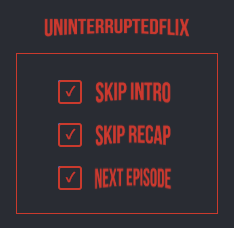

## Description

UninterruptedFlix is a Chrome extension that enhances your Netflix viewing experience. It automatically clicks the 'Skip Intro', 'Skip Recap' and 'Next Episode' buttons on Netflix videos as soon as they appear, providing an uninterrupted viewing experience. The extension recognises these buttons in multiple languages by inspecting the page's `lang` attribute, so it works across different locales.

## Installation

1. Download or clone this repository to your local machine.
2. Run `npm install` and then `npm run build` to generate the `dist` folder.
3. Open the Chrome browser and navigate to `chrome://extensions`.
4. Enable Developer mode by ticking the checkbox in the upper-right corner.
5. Click on the "Load unpacked" button and select the `dist` directory created in the previous step.

## Build

Run `npm run build` whenever you make changes to regenerate the extension in the `dist` folder.

## Loading the `dist` Directory in Chrome

The repository already includes a `dist` directory with the compiled extension,
so you can load it directly without running the build step:

1. Open Chrome and navigate to `chrome://extensions`.
2. Enable **Developer mode** using the toggle in the top-right corner.
3. Click **Load unpacked** and select the `dist` directory.

Run `npm run build` only if you modify the source code and need to regenerate
the files inside `dist`.

## Usage

Once installed, the extension will automatically skip intros, recaps and jump to the next episode when possible. You can enable or disable these features by clicking on the extension icon in the Chrome toolbar.

## For Developers

This project is built with TypeScript. The main logic is in the `src/content/content.ts` file. This script uses a MutationObserver to detect when the 'Skip Intro', 'Skip Recap' and 'Next Episode' buttons appear on the page and clicks them.

The extension's settings and metadata are defined in the `manifest.json` file. This includes the permissions the extension needs, the scripts it runs, and the icons it uses.

Feel free to contribute to this project by submitting pull requests. Before opening one, run `npm run lint` and `npm test` to ensure code quality.

## Testing

The project includes unit tests powered by Jest and React Testing Library. Run `npm test` to execute all tests. Linting rules are enforced with ESLint, which you can run using `npm run lint`.

## License

This project is licensed under the MIT License.

